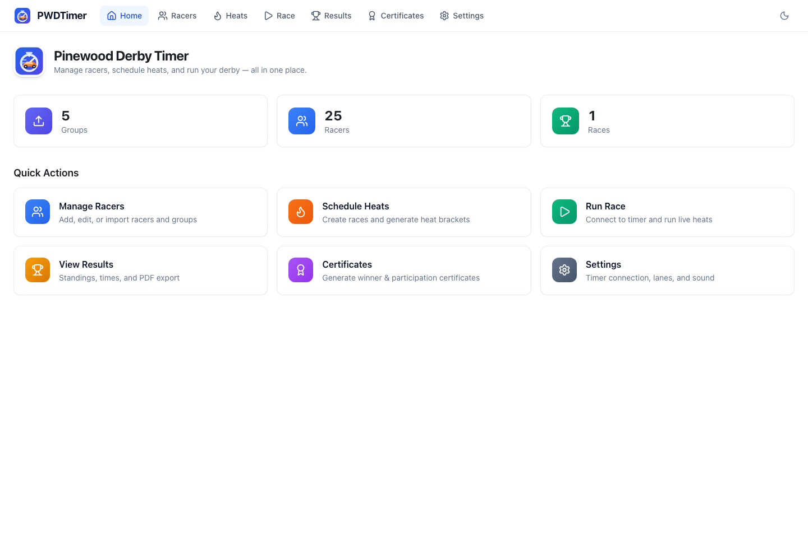
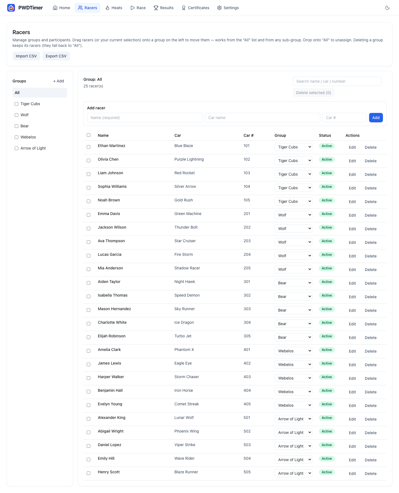
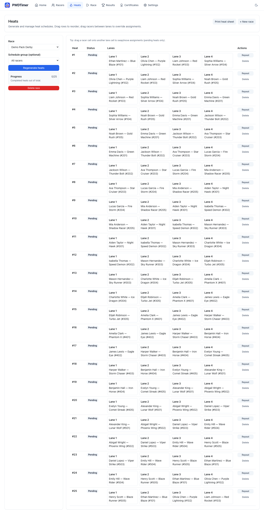
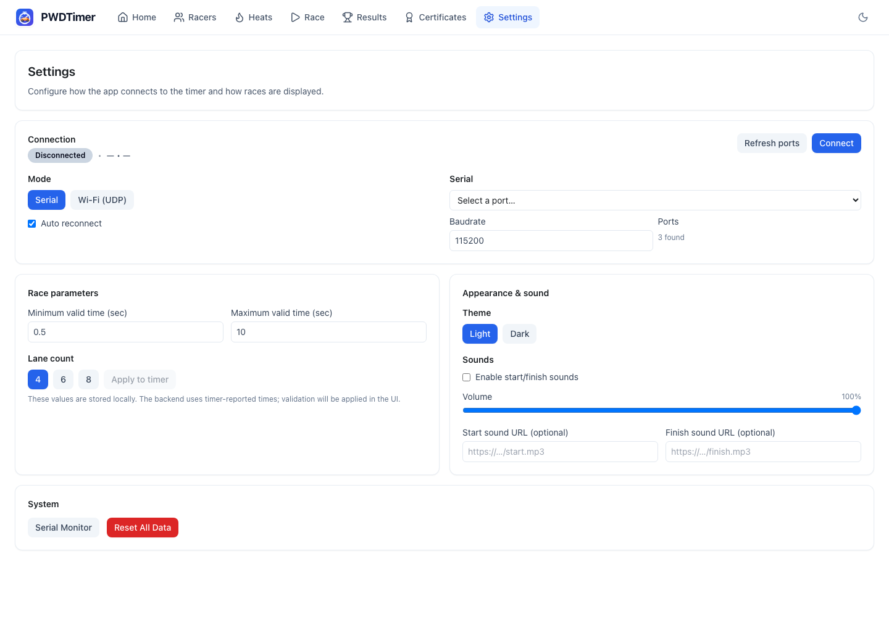
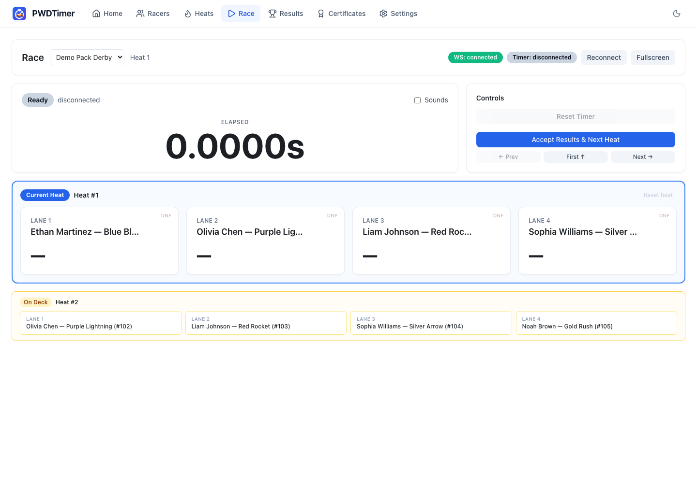
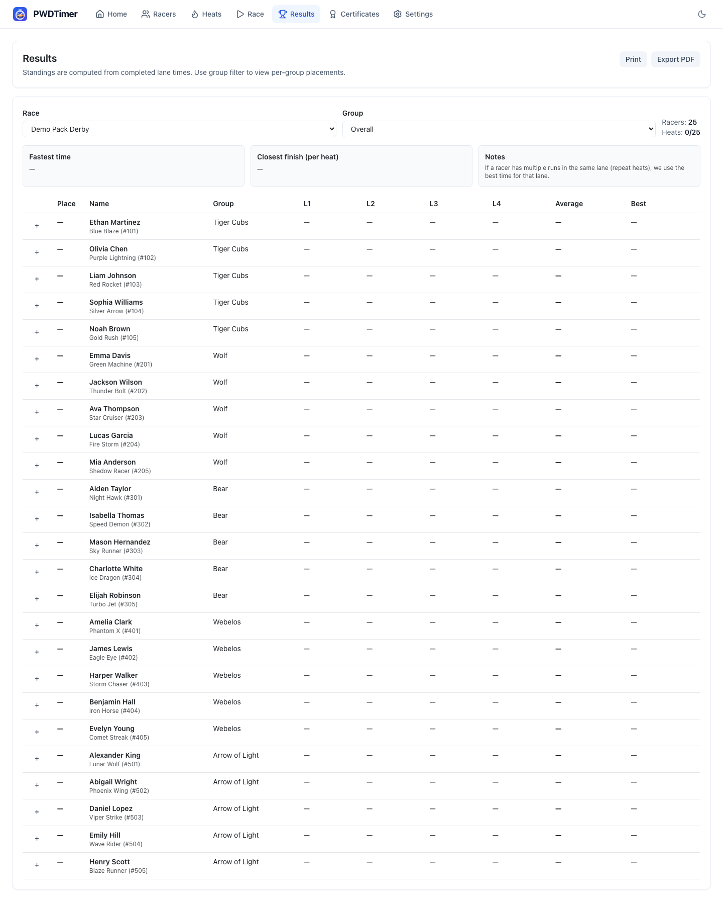
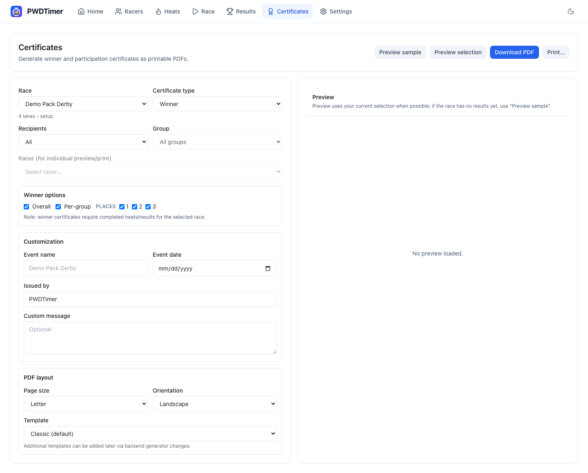

# PWDTimer User Manual

This manual is for the race runner using an already-built PWDTimer system. It assumes the timer hardware is assembled, the firmware is flashed, and the application is installed or available on the race computer.

## What you need on race day

- The race computer with PWDTimer installed or the source checkout available.
- The ESP32 timer connected by USB, or the timer powered and broadcasting the `PWDTimer` Wi-Fi network.
- The finish-line sensors aligned and plugged into the timer board.
- The start-gate sensor plugged in and adjusted.
- A racer CSV file. The example file is `example_racer_files/racers_demo.csv`.
- A projector or external display if you want audience fullscreen mode.

## Start the application

If you have a packaged desktop app, open `PWDTimer.app`, `PWDTimer.exe`, or the `PWDTimer` executable.

If you are running from source:

```bash
cd PWDTimer
./scripts/run-desktop.sh
```

Browser mode from source:

```bash
./scripts/run-desktop.sh --headless
```

Development mode:

```bash
./scripts/start.sh
```

Then open `http://localhost:5173`.

## Home

The Home page gives quick links to the normal workflow: add racers, schedule heats, run the race, review results, print certificates, and adjust settings.



## Add racers

Open **Racers**.



### Import a CSV

1. Click **Import CSV**.
2. Choose `example_racer_files/racers_demo.csv` or your event's racer file.
3. Confirm that the fields map correctly.
4. Click **Import**.

Recommended CSV columns:

```csv
name,car_name,car_number,group
Ethan Martinez,Blue Blaze,101,Tiger Cubs
Olivia Chen,Purple Lightning,102,Tiger Cubs
```

The importer creates groups automatically when a `group` value is present.

### Check racer data

Before scheduling, confirm:

- Every racer has the correct name.
- Car numbers are unique enough for your check-in process.
- Groups match the awards you plan to announce.
- No test/demo racers remain in a real event database.

## Create a race and generate heats

Open **Heats**.



1. Click **Create Race**.
2. Name the race, for example `Pack Derby 2026`.
3. Set the lane count to match the physical track.
4. Click **Generate Heats**.

PWDTimer generates a round-robin schedule so racers rotate through lanes. If a heat needs manual adjustment, drag racer cells between pending lanes before the heat is run.

Print the heat schedule if your staging team wants a paper queue.

## Connect the timer

Open **Settings**.



### USB serial connection

1. Connect the ESP32 timer by USB.
2. Choose **Serial**.
3. Click **Refresh ports**.
4. Select the ESP32 serial port.
5. Confirm baud rate `115200`.
6. Click **Connect**.
7. Set the lane count and click **Send to timer** if needed.

Typical ports:

| System | Example |
| --- | --- |
| macOS | `/dev/cu.usbserial-*` or `/dev/cu.SLAB_USBtoUART` |
| Linux | `/dev/ttyUSB0` or `/dev/ttyACM0` |
| Windows | `COM3`, `COM4`, etc. |

### Wi-Fi UDP connection

1. Power the timer.
2. Join the `PWDTimer` Wi-Fi network.
3. Use password `pinewood2025`.
4. Choose **Wi-Fi (UDP)** in Settings.
5. Use host `192.168.4.1`, command port `9100`, status port `9101`.
6. Click **Connect**.

USB serial and Wi-Fi can both remain active on the firmware. Keep USB plugged in if you want a reliable fallback.

## Run races

Open **Race**.



For each heat:

1. Place cars in the lanes shown on screen.
2. Close the start gate. The timer should show **Set** when the gate is ready.
3. Start the race by releasing the gate.
4. Watch lane cards fill in as cars finish.
5. Mark a lane **DNF** if a car does not finish and the heat should still be accepted.
6. Click **Accept Heat** after times look correct.
7. Move to the next heat.

Use **Reset** when a false start or sensor problem means the heat should be run again. Use **Repeat** from the Heats page if you need to preserve the original heat and append a rerun.

### Projector mode

Use the fullscreen control on the Race page for an audience display. If using a second monitor or projector, move the browser/app window to that display before entering fullscreen.

## Results

Open **Results** after heats have accepted times.



Use this page to:

- Review overall standings.
- Filter or read group standings.
- Check each racer's lane times.
- Export a PDF results report.

Before announcing awards, scan for missing times, unexpected DNFs, or obvious sensor mistakes.

## Certificates

Open **Certificates**.



1. Select the race.
2. Choose winner, participation, or custom certificates.
3. Fill in event name, date, and issued-by text.
4. Preview a sample.
5. Generate the PDF.

Print certificates after confirming the final results.

## End-of-event checklist

1. Export or print final results.
2. Generate certificates if needed.
3. Save a backup copy of the database or use `--db` to keep event-specific databases.
4. Disconnect the timer in Settings before unplugging hardware.
5. Keep the racer CSV and PDF results with your event records.

## Common race-day fixes

| Symptom | What to try |
| --- | --- |
| No serial ports appear | Use a data USB cable, install the USB serial driver, then refresh ports. |
| Wi-Fi connects but no data arrives | Confirm host `192.168.4.1`, UDP ports `9100` and `9101`, and that the computer is on the `PWDTimer` network. |
| Race never finishes | A lane sensor missed a car. Check alignment, mark DNF, or reset and rerun. |
| Times look impossible | Check gate sensor behavior and lane sensor sensitivity before accepting the heat. |
| Wrong lane count | Change lane count in Settings and send it to the timer before generating/running heats. |
